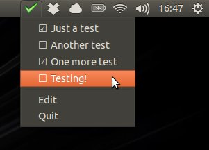

ToDo List Indicator
-------------------

A minimalistic app that puts a ToDo list as an Indicator near the system clock on Ubuntu.

A description of the app is available on [my blog](http://brunosmartins.info/a-very-simple-todo-list-for-ubuntu/ "A very simple ToDo list for Ubuntu").

